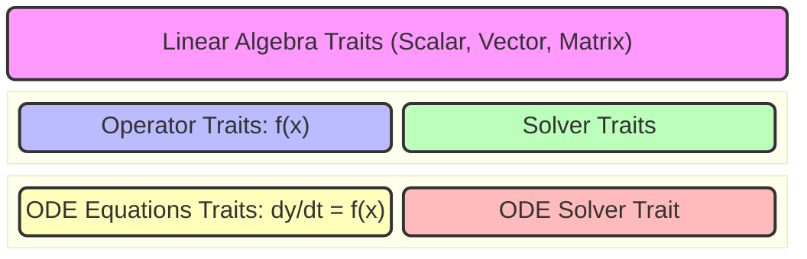

---
# You can also start simply with 'default'
theme: dracula
# random image from a curated Unsplash collection by Anthony
# like them? see https://unsplash.com/collections/94734566/slidev
# background: https://cover.sli.dev
# some information about your slides (markdown enabled)
title: Diffsol, a crate for solving differential equations
info: |
  Diffsol slides for Scientific Computing with Rust 2025
  Learn more at https://github.com/martinjrobins/diffsol
# apply unocss classes to the current slide
class: text-center
# https://sli.dev/features/drawing
drawings:
  persist: false
# slide transition: https://sli.dev/guide/animations.html#slide-transitions
transition: slide-left
# enable MDC Syntax: https://sli.dev/features/mdc
mdc: true
# open graph
# seoMeta:
#  ogImage: https://cover.sli.dev
---

# Diffsol - a crate for solving differential equations

 https://github.com/martinjrobins/diffsol

Martin Robinson 

Oxford Research Software Engineering Group

Doctoral Training Centre

University of Oxford


<div class="abs-br m-6 text-xl">
  <a href="https://github.com/martinjrobins/diffsol" target="_blank" class="slidev-icon-btn">
    <carbon:logo-github />
  </a>
</div>

<!--
The last comment block of each slide will be treated as slide notes. It will be visible and editable in Presenter Mode along with the slide. [Read more in the docs](https://sli.dev/guide/syntax.html#notes)
-->

---
level: 1
---


# Contents

<Toc text-sm minDepth="2" maxDepth="3" />

---
level: 2
---

# What is diffsol?

Diffsol is a library for solving ordinary differential equations (ODEs) or semi-explicit differential algebraic equations (DAEs) in Rust. It can solve equations in the following form:

$$
\begin{align*}
M \frac{dy}{dt} &= f(t, y, p) \\
y(0) &= y_0(p) \\
\end{align*}
$$

where 

- $M$ is a (possibly singular and optional) mass matrix, 
- $y$ is the state vector, 
- $t$ is the time and 
- $p$ is a vector of parameters.


<!--
Here is another comment.
-->

---
level: 3
---
# Features

**Solver Methods**:

1. A variable order Backwards Difference Formulae (BDF) solver
1. A Singly Diagonally Implicit Runge-Kutta (SDIRK or ESDIRK) solver (TR-BDF2 and ESDIRK34 tableaus)
1. A variable order Explict Runge-Kutta (ERK) solver (TSIT45 tableau)

**Solver Options**:
1. Adaptive step-size error control with dense output
1. High-level "solve" API or manual time-stepping, event handling, etc.
1. Numerical quadrature of an optional output function $g(t, y, p)$
1. Forwards and adjoint sensitivity analysis


---
level: 3
---

# How to provide equations to diffsol

1. **DiffSL Domain Specific Language (DSL).**

   Simple string syntax allowing for using diffsol from a high-level language like Python or R.

```
in = [a]
a { 1.0 }
u { 1.0 }
F { -a * u }
```

2. **Rust closures.**

    Useful for defining equations using familiar Rust syntax.

```rust
|x, p, _t, y| y[0] = -p[0] * x[0];
``` 

3. **Struct implementing the `OdeEquations` trait.**

    Most flexible, useful if you need to store state and share between equations, or if you want to use interior mutability to cache intermediate computations.


---
level: 3
---

# Example: The logistic growth model

$$
\begin{align*}
\frac{dr}{dt} &= r \cdot u \cdot \left(1 - \frac{u}{k}\right) \\
u(0) &= 0.1 \\
\end{align*}
$$

Using DiffSL DSL:

```rust
let problem = OdeBuilder::<M>::new()
    .build_from_diffsl::<CG>(
        "
        in = [r, k]
        r { 1.0 }
        k { 1.0 }
        u { 0.1 }
        F { r * u * (1.0 - u / k) }
        ",
    )
    .unwrap();
let mut solver = problem.bdf::<LS>().unwrap();
let (ys, ts) = solver.solve(40.0).unwrap();
```

---
level: 4
---

# Example: The logistic growth model

$$
\begin{align*}
\frac{dr}{dt} &= r \cdot u \cdot \left(1 - \frac{u}{k}\right) \\
u(0) &= 0.1 \\
\end{align*}
$$

Using Rust closures:

```rust
let problem = OdeBuilder::<M>::new()
    .p(vec![1.0, 10.0])
    .rhs_implicit(
        |x, p, _t, y| y[0] = p[0] * x[0] * (1.0 - x[0] / p[1]),
        |x, p, _t, v, y| y[0] = p[0] * v[0] * (1.0 - 2.0 * x[0] / p[1]),
    )
    .init(|_p, _t, y| y.fill(0.1), 1)
    .build()
    .unwrap()
let mut solver = problem.bdf::<LS>().unwrap();
let (ys, ts) = solver.solve(40.0).unwrap();
```


---
level: 2
---

# Diffsol architecture (traits)

Traits allow for easily swapping out and combining different vector, matrix and solvers concrete types.



---
level: 3
---

# Linear algebra traits
- [`Vector`](https://docs.rs/diffsol/latest/diffsol/vector/trait.Vector.html)
    - defines vector operations on dense vectors
    - e.g. construction, addition, element-wise multiplication, AXPY, gather, scatter etc.
- [`Matrix`](https://docs.rs/diffsol/latest/diffsol/matrix/trait.Matrix.html) 
    - defines matrix operations on dense and sparse matrices 
    - sparsity pattern as an associated type
    - e.g. construction, addition, GEMV, etc.
- [`DenseMatrix`](https://docs.rs/diffsol/latest/diffsol/matrix/trait.DenseMatrix.html)
    - sub-trait for defining dense matrix operations on column-major matrices
    - column slicing and mutation
      

---
level: 3
---

# Operator and solver traits 

*Associated types define the vector/matrix types they operate on...*

Operator traits:
   - [`NonLinearOp`](https://docs.rs/diffsol/latest/diffsol/op/nonlinear_op/trait.NonLinearOp.html) for a non-linear operation: $f(x, t)$, 
      - [`NonLinearOpJacobian`](https://docs.rs/diffsol/latest/diffsol/op/nonlinear_op/trait.NonLinearOpJacobian.html) for the Jacobian $\frac{\partial f}{\partial x} v$
      - [`NonLinearOpAdjoint`](https://docs.rs/diffsol/latest/diffsol/op/nonlinear_op/trait.NonLinearOpAdjoint.html) for the adjoint Jacobian $\frac{\partial f}{\partial x}^T V$
      - [`NonLinearOpSens`](https://docs.rs/diffsol/latest/diffsol/op/nonlinear_op/trait.NonLinearOpSens.html) $\frac{\partial f}{\partial p} V$
      - [`NonLinearOpSensAdjoint`](https://docs.rs/diffsol/latest/diffsol/op/nonlinear_op/trait.NonLinearOpSensAdjoint.html) $\frac{\partial f}{\partial p}^T V$
   - [`LinearOp`](https://docs.rs/diffsol/latest/diffsol/op/linear_op/trait.LinearOp.html) for a linear operation wrt $x$ (e.g. $Ax + b$)
   - [`ConstantOp`](https://docs.rs/diffsol/latest/diffsol/op/constant_op/trait.ConstantOp.html) for a constant operation wrt $x$ (e.g. $b$)

Solver traits:
   - [`LinearSolver`](https://docs.rs/diffsol/latest/diffsol/linear_solver/trait.LinearSolver.html) for solving linear systems $Ax = b$
   - [`NonLinearSolver`](https://docs.rs/diffsol/latest/diffsol/nonlinear_solver/trait.NonLinearSolver.html) for solving non-linear systems $f(x, t) = 0$

---
level: 3
---

# ODE equations trait

The set of ODE equations to be solved. 

Allows users to define their own equation structs and share data between them.

```rust
pub trait OdeEquationsRef<'a, ImplicitBounds: Sealed = Bounds<&'a Self>>: Op {
    type Rhs: NonLinearOp<M = Self::M, V = Self::V, T = Self::T, C = Self::C>;
    type Init: ConstantOp<M = Self::M, V = Self::V, T = Self::T, C = Self::C>;
    type Mass: LinearOp<M = Self::M, V = Self::V, T = Self::T, C = Self::C>;
    type Root: NonLinearOp<M = Self::M, V = Self::V, T = Self::T, C = Self::C>;
    type Out: NonLinearOp<M = Self::M, V = Self::V, T = Self::T, C = Self::C>;
}
pub trait OdeEquations: for<'a> OdeEquationsRef<'a> {
    fn rhs(&self) -> <Self as OdeEquationsRef<'_>>::Rhs;
    fn init(&self) -> <Self as OdeEquationsRef<'_>>::Init;
    fn mass(&self) -> Option<<Self as OdeEquationsRef<'_>>::Mass>;
    fn root(&self) -> Option<<Self as OdeEquationsRef<'_>>::Root>;
    fn out(&self) -> Option<<Self as OdeEquationsRef<'_>>::Out>;
    fn set_params(&mut self, p: &Self::V);
    fn get_params(&self, p: &mut Self::V);
}
```

---
level: 3
---
# ODE equations sub-traits

Different solvers require different information about the equations to be solved.

E.g. Implicit solvers require jacobian information for the RHS

```rust
pub trait OdeEquationsImplicit:
    OdeEquations<Rhs: NonLinearOpJacobian<M = Self::M, V = Self::V, T = Self::T, C = Self::C>>
{}
```

E.g. Forwards sensitivity analysis requires sensitivity information for the RHS and initial conditions

```rust
pub trait OdeEquationsImplicitSens:
    OdeEquationsImplicit<
      Rhs: NonLinearOpSens<M = Self::M, V = Self::V, T = Self::T, C = Self::C>,
      Init: ConstantOpSens<M = Self::M, V = Self::V, T = Self::T, C = Self::C>,
  >
{}
```

Individual solvers can then use these traits as bounds for the equations they solve. Compile error if the equations do not implement the required traits.

---
level: 3
---

# The ODE solver method trait

This is the public interface for all the solver methods.

```rust
pub trait OdeSolverMethod<'a, Eqn>: Clone
where
    Self: Sized,
    Eqn: 'a + OdeEquations,
{
    type State: OdeSolverState<Eqn::V>;

    // Some example of required methods...
    fn state(&self) -> StateRef<'_, Eqn::V>;
    fn state_mut(&mut self) -> StateRefMut<'_, Eqn::V>;
    fn step(&mut self) -> Result<OdeSolverStopReason<Eqn::T>, DiffsolError>;
    fn set_stop_time(&mut self, tstop: Eqn::T) -> Result<(), DiffsolError>;
    fn interpolate(&self, t: Eqn::T) -> Result<Eqn::V, DiffsolError>;
    //...

    // An example provided method...
    fn solve(&mut self, final_time: Eqn::T,
    ) -> Result<(<Eqn::V as DefaultDenseMatrix>::M, Vec<Eqn::T>), DiffsolError>
       where Eqn::V: DefaultDenseMatrix,
             Self: Sized { ... }
    //...
}
```

---
level: 3
---

# Closing thoughts

## Advantages

- **Flexibility**: The use of traits allows for easy swapping of different vector, matrix and solver combinations.
- **Modularity**: Can reuse solvers, matrix operations, equations, etc. across different but related problems.
- **Performance**: Generic types allow for the above without sacrificing performance.

## Disadvantages

- **Complexity**: Proliferation of generic types and complex interlocking trait bounds.
- **Repetition**: Forced to repeat complex trait bounds across multiple impls, lack of default associated types (on its way https://github.com/rust-lang/rust/issues/29661)
- **GATs with lifetimes**: Difficult to use, see `OdeEquationsRef` and `OdeEquations` traits.
- **Poor linting**: Rust-analyzer slow to lint code, very large memory usage and requires constant restarts.


---
layout: center
class: text-center
---

# Qustions?

[Diffsol book](https://martinjrobins.github.io/diffsol/) · [GitHub](https://github.com/martinjrobins/diffsol)

Martin Robinson

Oxford Research Software Engineering Group

Doctoral Training Centre

University of Oxford

martin.robinson@dtc.ox.ac.uk
