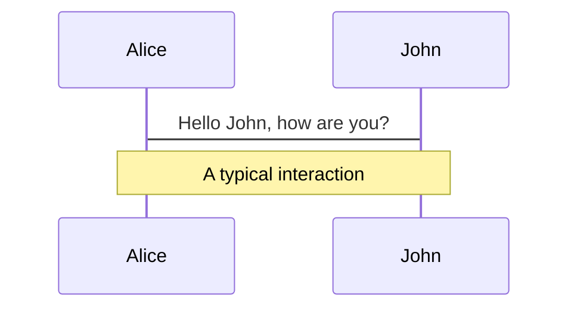
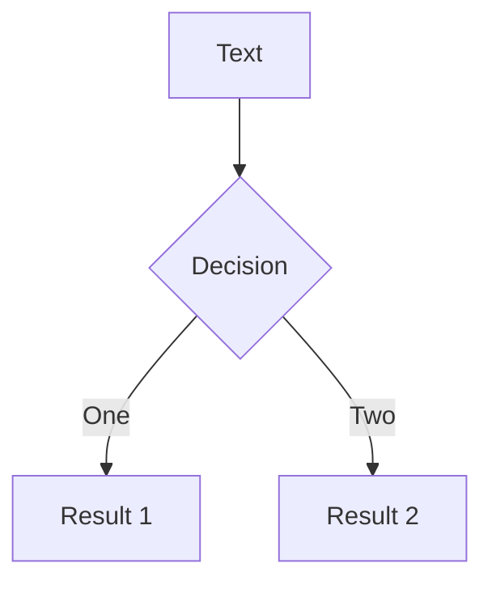
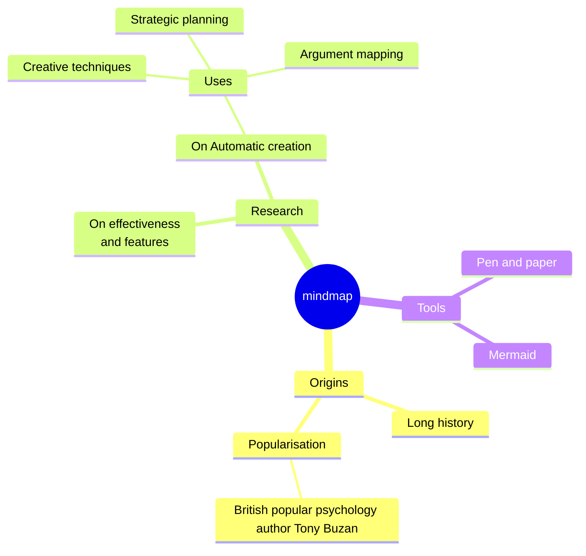
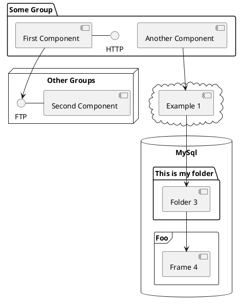

---
# You can also start simply with 'default'
theme: dracula
# random image from a curated Unsplash collection by Anthony
# like them? see https://unsplash.com/collections/94734566/slidev
background: https://cover.sli.dev
# some information about your slides (markdown enabled)
title: Diffsol, a crate for solving differential equations
info: |
  Diffsol slides for Scientific Computing with Rust 2025
  Learn more at https://github.com/martinjrobins/diffsol
# apply unocss classes to the current slide
class: text-center
# https://sli.dev/features/drawing
drawings:
  persist: false
# slide transition: https://sli.dev/guide/animations.html#slide-transitions
transition: slide-left
# enable MDC Syntax: https://sli.dev/features/mdc
mdc: true
# open graph
# seoMeta:
#  ogImage: https://cover.sli.dev
---

# Diffsol - a crate for solving differential equations

 https://github.com/martinjrobins/diffsol

Martin Robinson 

Oxford Research Software Engineering Group

Doctoral Training Centre

University of Oxford


<div class="abs-br m-6 text-xl">
  <a href="https://github.com/martinjrobins/diffsol" target="_blank" class="slidev-icon-btn">
    <carbon:logo-github />
  </a>
</div>

<!--
The last comment block of each slide will be treated as slide notes. It will be visible and editable in Presenter Mode along with the slide. [Read more in the docs](https://sli.dev/guide/syntax.html#notes)
-->

---
level: 1
---

# Contents

<Toc text-sm minDepth="2" maxDepth="3" />

---
level: 2
---

# What is diffsol?

Diffsol is a library for solving ordinary differential equations (ODEs) or semi-explicit differential algebraic equations (DAEs) in Rust. It can solve equations in the following form:

$$
M \frac{dy}{dt} = f(t, y, p)
$$

where 

- $M$ is a (possibly singular and optional) mass matrix, 
- $y$ is the state vector, 
- $t$ is the time and 
- $p$ is a vector of parameters.


<!--
Here is another comment.
-->

---
level: 3
---
# Features

**Solver Methods**:

1. A variable order Backwards Difference Formulae (BDF) solver
1. A Singly Diagonally Implicit Runge-Kutta (SDIRK or ESDIRK) solver (TR-BDF2 and ESDIRK34 tableaus)
1. A variable order Explict Runge-Kutta (ERK) solver (TSIT45 tableau)

**Solver Options**:
1. Adaptive step-size error control with dense output
1. Event handling
1. Numerical quadrature
1. Forwards and adjoint sensitivity analysis


---
transition: slide-up
level: 3
---

# How to provide equations to diffsol

1. **DiffSL Domain Specific Language (DSL).**

   Simple string syntax allowing for using diffsol from a high-level language like Python or R.

```
in = [a]
a { 1.0 }
u { 1.0 }
F { -a * u }
```

2. **Rust closures.**

    Useful for defining equations using familiar Rust syntax.

```rust
|x, p, _t, y| y[0] = -p[0] * x[0];
``` 

3. **Struct implementing the `OdeEquations` trait.**

    Most flexible, useful if you need to store state and share between equations, or if you want to use interior mutability to cache intermediate computations.


---
transition: slide-up
level: 3
---

# Example - DiffSL DSL

Using DiffSL DSL:

```rust
let problem = OdeBuilder::<M>::new()
    .build_from_diffsl::<CG>(
        "
    a { 2.0/3.0 } b { 4.0/3.0 } c { 1.0 } d { 1.0 }
    u_i {
        y1 = 1,
        y2 = 1,
    }
    F_i {
        a * y1 - b * y1 * y2,
        c * y1 * y2 - d * y2,
    }
",
    )
    .unwrap();
let mut solver = problem.bdf::<LS>().unwrap();
let (ys, ts) = solver.solve(40.0).unwrap();
```

---
level: 3
---

# Example - Lotka-Volterra equations - Rust closures

Using Rust closures:

```rust
let problem = OdeBuilder::<M>::new()
    .p(vec![1.0, 10.0])
    .rhs(|x, p, _t, y| y[0] = p[0] * x[0] * (1.0 - x[0] / p[1]))
    .init(|_p, _t, y| y.fill(0.1), 1)
    .build()
    .unwrap()
let mut solver = problem.bdf::<LS>().unwrap();
let (ys, ts) = solver.solve(40.0).unwrap();
```


---
level: 2
---

# Diffsol Traits

Traits allow for easily swapping out and combining different underlying vector, matrix and solvers.

1. Linear algebra traits
   - `Vector` trait for defining vector operations on dense vectors
   - `Matrix` trait for defining matrix operations on dense and sparse matrices 
      - `DenseMatrix` sub-trait for defining dense matrix operations
1. Operator traits (associated types for the vector types they operate on)
   - `NonLinearOp` for a non-linear operation wrt $x$ (e.g. $f(x, p, t)$), 
      - `NonLinearOpJacobian` for the Jacobian $\frac{\partial f}{\partial x} v$
      - `NonLinearOpAdjoint` for the adjoint Jacobian $\frac{\partial f}{\partial x}^T V$
      - `NonLinearOpSens` $\frac{\partial f}{\partial p} V$
      - `NonLinearOpSensAdjoint` $\frac{\partial f}{\partial p}^T V$
   - `LinearOp` for a linear operation wrt $x$ (e.g. $Ax + b$)
   - `ConstantOp` for a constant operation wrt $x$ (e.g. $b$)

---

# Solver traits

1. `LinearSolver` for solving linear systems $Ax = b$
2. `NonLinearSolver` for solving non-linear systems $f(x, t) = 0$

Example, a Newton non-linear solver:

```rust
pub struct NewtonNonlinearSolver<M: Matrix, Ls: LinearSolver<M>> {
    linear_solver: Ls,
}

impl<M: Matrix, Ls: LinearSolver<M>> NonLinearSolver<M> for NewtonNonlinearSolver<M, Ls> {
  fn solve_in_place<C: NonLinearOp<V = M::V, T = M::T, M = M>>(
        &mut self,
        op: &C,
        xn: &mut M::V,
        t: M::T,
        error_y: &M::V,
        convergence: &mut Convergence<M::V>,
    ) -> Result<(), DiffsolError> {
    // ...
  }
  // a few other methods to allow for efficient solving on a time-series (i.e. caching the Jacobian)
}
```

---
level: 3
---
# Ode Equations Trait

The set of ODE equations to be solved. 

Allows users to define their own equation structs and share data between them.

```rust
pub trait OdeEquationsRef<'a, ImplicitBounds: Sealed = Bounds<&'a Self>>: Op {
    type Rhs: NonLinearOp<M = Self::M, V = Self::V, T = Self::T, C = Self::C>;
    type Init: ConstantOp<M = Self::M, V = Self::V, T = Self::T, C = Self::C>;
    type Mass: LinearOp<M = Self::M, V = Self::V, T = Self::T, C = Self::C>;
    type Root: NonLinearOp<M = Self::M, V = Self::V, T = Self::T, C = Self::C>;
    type Out: NonLinearOp<M = Self::M, V = Self::V, T = Self::T, C = Self::C>;
}
pub trait OdeEquations: for<'a> OdeEquationsRef<'a> {
    fn rhs(&self) -> <Self as OdeEquationsRef<'_>>::Rhs;
    fn init(&self) -> <Self as OdeEquationsRef<'_>>::Init;
    fn mass(&self) -> Option<<Self as OdeEquationsRef<'_>>::Mass>;
    fn root(&self) -> Option<<Self as OdeEquationsRef<'_>>::Root>;
    fn out(&self) -> Option<<Self as OdeEquationsRef<'_>>::Out>;
    fn set_params(&mut self, p: &Self::V);
    fn get_params(&self, p: &mut Self::V);
}
```

---
level: 3
---
# Different classes of ODE equations

Different solvers require different information about the equations to be solved.

E.g. Implicit solvers require jacobian information for the RHS

```rust
pub trait OdeEquationsImplicit:
    OdeEquations<Rhs: NonLinearOpJacobian<M = Self::M, V = Self::V, T = Self::T, C = Self::C>>
{}
```

E.g. Forwards sensitivity analysis requires sensitivity information for the RHS and initial conditions

```rust
pub trait OdeEquationsImplicitSens:
    OdeEquationsImplicit<
      Rhs: NonLinearOpSens<M = Self::M, V = Self::V, T = Self::T, C = Self::C>,
      Init: ConstantOpSens<M = Self::M, V = Self::V, T = Self::T, C = Self::C>,
  >
{}
```

Individual solvers can then use these traits as bounds for the equations they solve. Compile error if the equations do not implement the required traits.


---
level: 3
---

# Eating your own tail

*Implicit ODE solvers are a series of nonlinear solves with good initial guesses...*

e.g. BDF solvers discretise the ODE equations to give an non-linear equations of the form:

$$
M (y - y_0 + \psi) - c f(y) = 0
$$

So just implement the `NonLinearOp` and `NonLinearOpJacobian` traits for the operator:

```rust
pub struct BdfCallable<Eqn: OdeEquationsImplicit> {...}
impl<Eqn: OdeEquationsImplicit> NonLinearOp for BdfCallable<Eqn> {
  fn call_inplace(&self, x: &Eqn::V, t: Eqn::T, y: &mut Eqn::V) { ... }
}
impl<Eqn: OdeEquationsImplicit> NonLinearOpJacobian for BdfCallable<Eqn> {
  fn jac_mul_inplace(&self, x: &Eqn::V, t: Eqn::T, v: &Eqn::V, y: &mut Eqn::V) { ... }
}

```


Use code snippets and get the highlighting directly, and even types hover!

```ts {all|5|7|7-8|10|all} twoslash
// TwoSlash enables TypeScript hover information
// and errors in markdown code blocks
// More at https://shiki.style/packages/twoslash

import { computed, ref } from 'vue'

const count = ref(0)
const doubled = computed(() => count.value * 2)

doubled.value = 2
```

<arrow v-click="[4, 5]" x1="350" y1="310" x2="195" y2="334" color="#953" width="2" arrowSize="1" />

<!-- This allow you to embed external code blocks -->
<<< @/snippets/external.ts#snippet

<!-- Footer -->

[Learn more](https://sli.dev/features/line-highlighting)

<!-- Inline style -->
<style>
.footnotes-sep {
  @apply mt-5 opacity-10;
}
.footnotes {
  @apply text-sm opacity-75;
}
.footnote-backref {
  display: none;
}
</style>

<!--
Notes can also sync with clicks

[click] This will be highlighted after the first click

[click] Highlighted with `count = ref(0)`

[click:3] Last click (skip two clicks)
-->

---
level: 2
---

# Shiki Magic Move

Powered by [shiki-magic-move](https://shiki-magic-move.netlify.app/), Slidev supports animations across multiple code snippets.

Add multiple code blocks and wrap them with <code>````md magic-move</code> (four backticks) to enable the magic move. For example:

````md magic-move {lines: true}
```ts {*|2|*}
// step 1
const author = reactive({
  name: 'John Doe',
  books: [
    'Vue 2 - Advanced Guide',
    'Vue 3 - Basic Guide',
    'Vue 4 - The Mystery'
  ]
})
```

```ts {*|1-2|3-4|3-4,8}
// step 2
export default {
  data() {
    return {
      author: {
        name: 'John Doe',
        books: [
          'Vue 2 - Advanced Guide',
          'Vue 3 - Basic Guide',
          'Vue 4 - The Mystery'
        ]
      }
    }
  }
}
```

```ts
// step 3
export default {
  data: () => ({
    author: {
      name: 'John Doe',
      books: [
        'Vue 2 - Advanced Guide',
        'Vue 3 - Basic Guide',
        'Vue 4 - The Mystery'
      ]
    }
  })
}
```

Non-code blocks are ignored.

```vue
<!-- step 4 -->
<script setup>
const author = {
  name: 'John Doe',
  books: [
    'Vue 2 - Advanced Guide',
    'Vue 3 - Basic Guide',
    'Vue 4 - The Mystery'
  ]
}
</script>
```
````

---

# Components

<div grid="~ cols-2 gap-4">
<div>

You can use Vue components directly inside your slides.

We have provided a few built-in components like `<Tweet/>` and `<Youtube/>` that you can use directly. And adding your custom components is also super easy.

```html
<Counter :count="10" />
```

<!-- ./components/Counter.vue -->
<Counter :count="10" m="t-4" />

Check out [the guides](https://sli.dev/builtin/components.html) for more.

</div>
<div>

```html
<Tweet id="1390115482657726468" />
```

<Tweet id="1390115482657726468" scale="0.65" />

</div>
</div>

<!--
Presenter note with **bold**, *italic*, and ~~striked~~ text.

Also, HTML elements are valid:
<div class="flex w-full">
  <span style="flex-grow: 1;">Left content</span>
  <span>Right content</span>
</div>
-->

---
class: px-20
---

# Themes

Slidev comes with powerful theming support. Themes can provide styles, layouts, components, or even configurations for tools. Switching between themes by just **one edit** in your frontmatter:

<div grid="~ cols-2 gap-2" m="t-2">

```yaml
---
theme: default
---
```

```yaml
---
theme: seriph
---
```


</div>

Read more about [How to use a theme](https://sli.dev/guide/theme-addon#use-theme) and
check out the [Awesome Themes Gallery](https://sli.dev/resources/theme-gallery).

---

# Clicks Animations

You can add `v-click` to elements to add a click animation.

<div v-click>

This shows up when you click the slide:

```html
<div v-click>This shows up when you click the slide.</div>
```

</div>

<br>

<v-click>

The <span v-mark.red="3"><code>v-mark</code> directive</span>
also allows you to add
<span v-mark.circle.orange="4">inline marks</span>
, powered by [Rough Notation](https://roughnotation.com/):

```html
<span v-mark.underline.orange>inline markers</span>
```

</v-click>

<div mt-20 v-click>

[Learn more](https://sli.dev/guide/animations#click-animation)

</div>

---

# Motions

Motion animations are powered by [@vueuse/motion](https://motion.vueuse.org/), triggered by `v-motion` directive.

```html
<div
  v-motion
  :initial="{ x: -80 }"
  :enter="{ x: 0 }"
  :click-3="{ x: 80 }"
  :leave="{ x: 1000 }"
>
  Slidev
</div>
```

<div class="w-60 relative">
  <div class="relative w-40 h-40">
    
    
    
  </div>

  <div
    class="text-5xl absolute top-14 left-40 text-[#2B90B6] -z-1"
    v-motion
    :initial="{ x: -80, opacity: 0}"
    :enter="{ x: 0, opacity: 1, transition: { delay: 2000, duration: 1000 } }">
    Slidev
  </div>
</div>

<!-- vue script setup scripts can be directly used in markdown, and will only affects current page -->
<script setup lang="ts">
const final = {
  x: 0,
  y: 0,
  rotate: 0,
  scale: 1,
  transition: {
    type: 'spring',
    damping: 10,
    stiffness: 20,
    mass: 2
  }
}
</script>

<div
  v-motion
  :initial="{ x:35, y: 30, opacity: 0}"
  :enter="{ y: 0, opacity: 1, transition: { delay: 3500 } }">

[Learn more](https://sli.dev/guide/animations.html#motion)

</div>

---

# LaTeX

LaTeX is supported out-of-box. Powered by [KaTeX](https://katex.org/).

<div h-3 />

Inline $\sqrt{3x-1}+(1+x)^2$

Block
$$ {1|3|all}
\begin{aligned}
\nabla \cdot \vec{E} &= \frac{\rho}{\varepsilon_0} \\
\nabla \cdot \vec{B} &= 0 \\
\nabla \times \vec{E} &= -\frac{\partial\vec{B}}{\partial t} \\
\nabla \times \vec{B} &= \mu_0\vec{J} + \mu_0\varepsilon_0\frac{\partial\vec{E}}{\partial t}
\end{aligned}
$$

[Learn more](https://sli.dev/features/latex)

---

# Diagrams

You can create diagrams / graphs from textual descriptions, directly in your Markdown.

<div class="grid grid-cols-4 gap-5 pt-4 -mb-6">









</div>

Learn more: [Mermaid Diagrams](https://sli.dev/features/mermaid) and [PlantUML Diagrams](https://sli.dev/features/plantuml)

---
foo: bar
dragPos:
  square: 0,-5,0,0
---

# Draggable Elements

Double-click on the draggable elements to edit their positions.

<br>

###### Directive Usage

```md

```

<br>

###### Component Usage

```md
<v-drag text-3xl>
  <div class="i-carbon:arrow-up" />
  Use the `v-drag` component to have a draggable container!
</v-drag>
```

<v-drag pos="663,206,261,_,-15">
  <div text-center text-3xl border border-main rounded>
    Double-click me!
  </div>
</v-drag>


###### Draggable Arrow

```md
<v-drag-arrow two-way />
```

<v-drag-arrow pos="67,452,253,46" two-way op70 />

---
src: ./pages/imported-slides.md
hide: false
---

---

# Monaco Editor

Slidev provides built-in Monaco Editor support.

Add `{monaco}` to the code block to turn it into an editor:

```ts {monaco}
import { ref } from 'vue'
import { emptyArray } from './external'

const arr = ref(emptyArray(10))
```

Use `{monaco-run}` to create an editor that can execute the code directly in the slide:

```ts {monaco-run}
import { version } from 'vue'
import { emptyArray, sayHello } from './external'

sayHello()
console.log(`vue ${version}`)
console.log(emptyArray<number>(10).reduce(fib => [...fib, fib.at(-1)! + fib.at(-2)!], [1, 1]))
```

---
layout: center
class: text-center
---

# Learn More

[Documentation](https://sli.dev) · [GitHub](https://github.com/slidevjs/slidev) · [Showcases](https://sli.dev/resources/showcases)

<PoweredBySlidev mt-10 />
